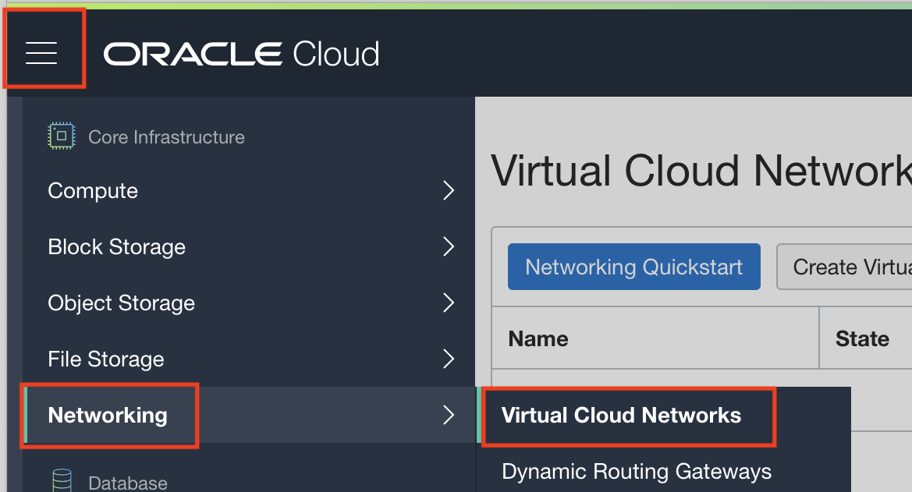
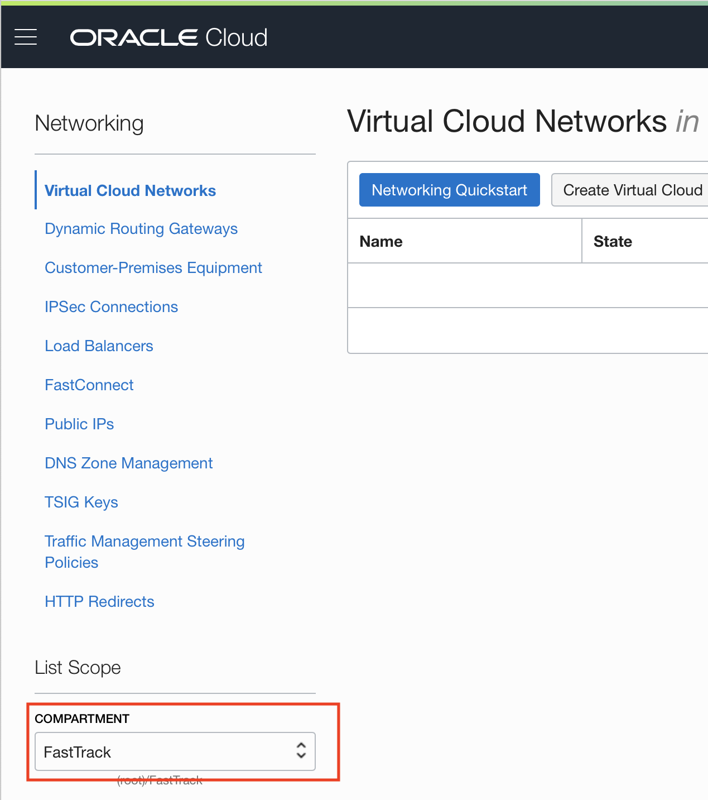
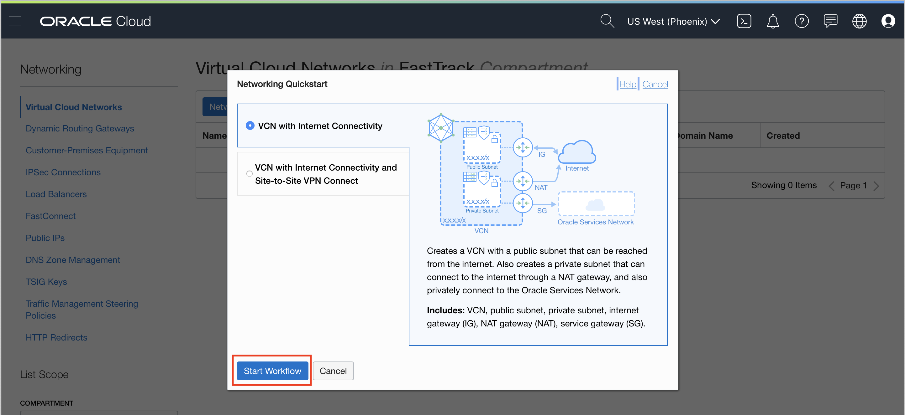
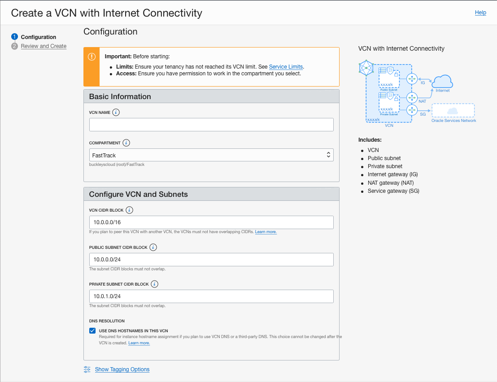
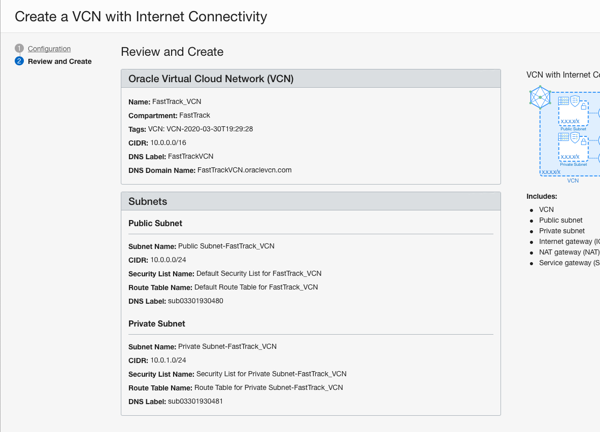
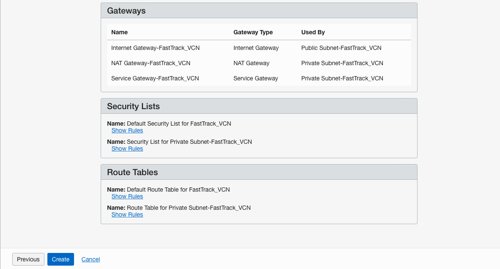
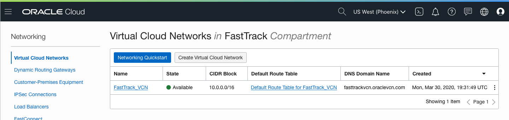
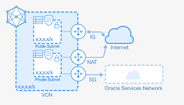

## Lab 2. Networking
The Virtual Cloud Network and It’s Resources

**Objectives**
- Create Oracle Virtual Cloud Network (VCN)
- Configure a regional private subnet and a regional public subnet
- Check that an Internet Gateway was provisioned, which will allow your VCN access to public internet
- Ensure Route Table has correct routing rules

## Create Oracle Cloud Network (VCN)
1. To create a network, go to Networking>>Virtual Cloud Networks, from the main menu.

**Don't forget to choose your compartment**

2. Click **Networking Quickstart** and make sure **VCN with Internet Connectivity** is selected. Click **Start Workflow**.

The OCI Console provides the option optimize the networking infrastructure creation process. By choosing the option “VCN with Internet Connectivity” in the Networking Quickstart option, OCI will create the entire network layer for you. OCI will create a 10.0.0/16 CIDR Block, the necessary subnets (regional), along with Route Tables, the Internet Gateway, and some firewall rules.

3. Enter a Name for your VCN and leave the other options as default. Make sure you selected the correct compartment.

4. After you click Next, you will have a description of the options that will be used in the VCN creation process:

Notice that your VCN CIDR block encompasses your public subnet CIDR block and your private subnet CIDR block which cannot overlap. Both the public subnet and private subnet are regional subnets when created using this workflow.

5. Click **Create**

The networking creation process is very quick, and when finished, will be shown as below:

## Subnets Inside a VCN
A VCN is a software-defined network that you set up in the Oracle Cloud Infrastructure data centers in a particular region. A subnet is a subdivision of a VCN that can be local to an Availabililty Domain or regional, spanning all Availability Domains within a region. For an overview of VCNs, allowed size, default VCN components, and scenarios for using a VCN, [see Overview of Networking](https://docs.cloud.oracle.com/en-us/iaas/Content/Network/Concepts/overview.htm).

Each subnet in a VCN consists of a contiguous range of IP addresses that do not overlap with other subnets in the VCN. For example: 10.0.0.0/24. The first two IP addresses and the last in the subnet's CIDR are reserved by the Networking service. You can't change the size of the subnet after creation, so it's important to think about the size of subnets you need before creating them. 

VCN is a cross-AD object. Inside it, we can create objects that will be positioned in any AD, inside the same region.

## Internet Gateway
You can think of an Internet Gateway as a virtual router connecting the edge of the cloud network with the internet. Traffic that originates in your VCN and is destined for a public IP address outside the VCN goes through the Internet Gateway. 

## Route Configuration for the Internet Gateway
Every VCN needs a Route Table that will direct Public IP’s traffic. You can click on the Route Tables section of your VPN to see which routes were created by default for your subnets.

After all the resources are created, your OCI tenant will have a structure that will look like this:

